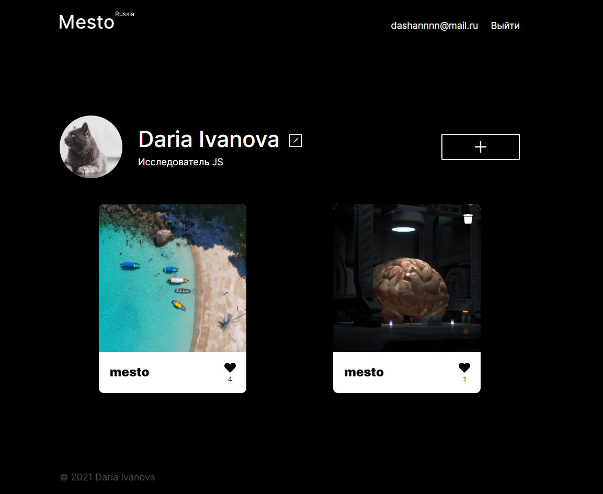

# Проект: Место

[Ссылка на сайт](https://mesto.dariy-iva.nomoredomains.rocks/)

Приложение для просмотра чужих и размещения собственных фотографий мест, где Вы были или только хотите побывать.

## О проекте

Проект Mesto с объединенными фронтенд и бэкенд частями.  
_Фронтенд_: написан на React с использованием функциональных компонентов и хуков. В проекте реализованы авторизация и регистрация пользователей с возможностью выхода, адаптация под различные размеры экранов, модальные окна для редактирования персональной информации, добавления постов на страницу, просмотра фотографий крупным планом, работают кнопки добавления/удаления лайков к постам, удаления постов, всплывающее окно для подтверждения удаления поста. Используются: функциональные компоненты, подписка на контекст, стейт-переменные, управление жизненным циклом с помощью useEffect, анимация для индикации при отправке формы.  
_Бэкенд_: написан на Express с подключением библиотек. Реализованы две сущности, созданы схемы и модели с помощью Mongoose: пользователи и карточки. Также реализованы валидация схем и запросов с использованием библиотек 'Joi' и 'Celebrate', защита роутов с помощью мидлвэры авторизации, создание токена с хранением в куках клиента, обработка ошибок (кастомная и централизованная), хеширование пароля пользователя с помощью bcrypt, логгирование запросов и ошибок с помощью библиотеки 'Winston', лимит на количество запросов в течение 15 минут.

### Стек:

* HTML
* CSS
* JS
* React
* Node.js
* Express
* MongoDB

  
Публичный IP: 51.250.7.145 
